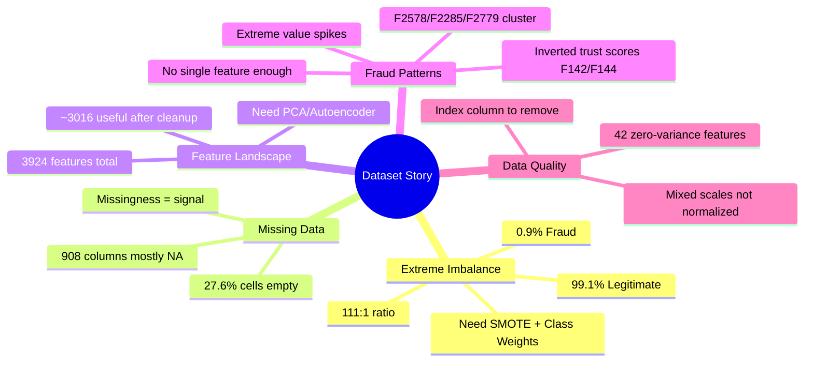

# FinSentry — Project Understanding, EDA & New Feature Suggestions

## 🎯 What Is This Project?

**FinSentry** is an AI-powered system designed to solve a critical real-world problem: **detecting fraudulent financial transactions and identifying "mule accounts"** — accounts that criminals use as intermediaries to move stolen money.

Think of it like a security guard for a bank, but instead of watching CCTV cameras, it watches **every single transaction** flowing through the system and raises an alarm when something looks suspicious.

### The Three Core Goals
1. **Fraud Detection** — Flag suspicious transactions before money is lost
2. **Mule Account Identification** — Find accounts being used as "middlemen" in money laundering chains (A → Mule → Mule → Criminal)
3. **Real-time Alerting** — Cross-reference with regulatory feeds (RBI/NPCI alerts) to catch known fraud patterns instantly

---

## 📊 Dataset — Explained Like You're a Beginner

### What Exactly Is This Dataset?

The dataset contains **9,082 financial transactions**, each described by **3,924 features** (think of features as "characteristics" or "properties" of each transaction). The last column, **F3924**, is the **answer key** — it tells us whether each transaction was **legitimate (0)** or **fraudulent (1)**.

> [!NOTE]
> **Analogy:** Imagine each transaction is a student in a class, and each feature is a question on a 3,924-question exam. The last column is the teacher's grade: pass (legit) or fail (fraud). Our AI needs to learn from the graded exams to predict future grades.

### The Big Numbers at a Glance

| What | Value | What It Means |
|---|---|---|
| Total transactions | **9,082** | A moderate-sized dataset — enough to learn, small enough to train fast |
| Total features | **3,924** | VERY wide — most datasets have 10-50 features. This has 3,924! |
| Legitimate transactions | **9,001 (99.11%)** | The overwhelming majority are normal |
| Fraudulent transactions | **81 (0.89%)** | Only 81 out of 9,082 are fraud — a needle in a haystack |
| Imbalance ratio | **111:1** | For every 1 fraud, there are 111 legitimate transactions |
| Missing data | **27.62%** | About 1 in 4 cells is empty — significant but manageable |
| Memory size | **~0.29 GB** | Can be processed on a regular laptop |

---

### 🔍 EDA Deep Dive — What the Data Tells Us

#### 1. The Needle-in-a-Haystack Problem (Class Imbalance)


**What you see:** The bar chart shows a massive green bar (9,001 legitimate) towering over a barely visible red sliver (81 fraud). The pie chart drives the point home — fraud is less than 1%.

**Why this matters (beginner explanation):**
- If our AI just says "everything is legitimate" for every transaction, it would be **99.11% accurate** — sounds great, right? But it would catch **ZERO frauds**. That's useless!
- This is why we can't use "accuracy" as our measure of success. Instead, we use metrics like **AUPRC (Area Under Precision-Recall Curve)** and **Recall** — "out of all actual frauds, how many did we catch?"
- We need special techniques: **SMOTE** (creating synthetic fraud examples), **class weights** (telling the AI that each fraud sample is 111× more important), and **focal loss** (making the AI focus harder on rare cases).

> [!IMPORTANT]
> **Key Insight:** This extreme imbalance (111:1) is actually **realistic**. In real banking systems, fraud rates are typically 0.1-2%. Our dataset mirrors real-world conditions, which is good for building a practical system.

---

#### 2. The Missing Data Challenge


**What you see:** 
- **Left chart:** Most columns have very few missing values (the big spike near 0%), but there's a troubling cluster near 90-100% missing
- **Right chart:** 908 columns are over 80% empty (purple bar), 2,697 have some missing data (orange bar), and only 90 columns are perfectly complete (tiny green bar)

**Why this matters:**
- **908 columns are mostly empty** — these are like having a 3,924-question exam where 908 questions are left blank by almost everyone. These need to be **dropped** (removed).
- The remaining missing values need **smart filling (imputation)**. We can't just use the average — we use **KNN Imputation** (looking at similar transactions to guess the missing value).
- **Plot twist:** Missing values themselves can be a signal! If fraud transactions tend to have certain fields blank that legitimate ones don't, the "missingness pattern" is itself a clue. We create **"was_this_missing"** indicator features.

---

#### 3. What Kinds of Features Do We Have?


**What you see:** A pie chart breaking down all 3,924 features into 4 types.

**Feature types explained:**

| Type | Count | What They Are (Beginner) | Example |
|---|---|---|---|
| **Continuous** | 1,906 (49%) | Numbers on a sliding scale — like temperature or amount | Values like 0.234, 0.891, 45.6 |
| **Binary** | 787 (20%) | Yes/No questions — either 0 or 1 | "Is this an international transaction?" → 0 or 1 |
| **Sparse** | 908 (23%) | Mostly empty columns (>80% NA) — likely optional fields | Rarely filled fields like "secondary phone" |
| **Other** | 323 (8%) | Low-cardinality or mixed-type features | Category codes, status flags |

**Key takeaway:** After removing the 908 sparse columns, we're working with ~3,016 useful features. That's still a LOT — we'll need **dimensionality reduction** (PCA or Autoencoders) to compress them into 100-300 core features.

---

#### 4. How Individual Features Look


**What you see:** Histograms of 12 randomly selected continuous features. Most show either:
- **Right-skewed distributions** (majority of values near 0, with a long tail)
- **Bimodal distributions** (two peaks, suggesting two distinct groups)
- **Uniform-ish spreads** between 0 and 1

**What this tells us:**
- Only ~16% of continuous features are neatly in the [0, 1] range — the data is **NOT fully pre-normalized** as initially assumed. Some features (like F2578, F2285) have values up to 700,000+.
- The skewed distributions suggest features representing things like **transaction amounts, counts, or cumulative sums** — typical financial data patterns.
- We'll need **robust scaling** (StandardScaler or RobustScaler) before feeding into models.

---

#### 5. The "Smoking Gun" Features — Fraud vs Legitimate


**What you see:** For each of the top 8 features, the green histogram (legitimate) and red histogram (fraud) are shown overlaid. The more they DON'T overlap, the more useful the feature is.

**The top discriminators (what the data is screaming at us):**

| Feature | Legit Mean | Fraud Mean | Effect Size | What This Probably Means |
|---|---|---|---|---|
| **F2578** | 86 | 11,729 | 2.36 | Fraudulent transactions involve **~137× larger amounts/counts** |
| **F2285** | 131 | 14,929 | 2.04 | Similar extreme spike — likely a **cumulative or aggregate** metric |
| **F2779** | 114 | 8,421 | 1.93 | Another volume/velocity indicator |
| **F2686** | 0.21 | 24.97 | 1.79 | A counter or frequency feature — fraud has **119× higher** values |
| **F255** | 0.095 | 0.50 | 1.53 | A probability/ratio feature — fraud has **5× higher** values |
| **F142** | 0.619 | 0.042 | 1.37 | **Inverted!** Legit transactions have HIGH values, fraud has LOW |

> [!TIP]
> **Beginner insight:** Features like F2578 and F2285 are the "red flags" — when these values spike dramatically, it's a strong indicator of fraud. Features like F142 and F144 work in reverse — they represent something that legitimate transactions DO but frauds DON'T (perhaps verification checks or account history depth).

---

#### 6. Feature Relationships (Correlation Heatmap)


**What you see:** A heatmap where darker red = strongly correlated, white = no correlation, blue = inversely correlated.

**Key observations:**
- **F2578, F2285, F2779** are HIGHLY correlated with each other (dark red cluster in top-left). They likely measure the same underlying phenomenon (e.g., transaction volume from different angles). We should **keep only one** to avoid redundancy.
- **F142, F144, F139, F141** form another cluster — these are all inversely related to fraud. They represent some "trust score" or "account maturity" metric.
- **F255 and F253** have the **highest direct correlation with the target (F3924)** at 0.17 — still weak, showing that no single feature can catch fraud alone. We need the **ensemble approach**.
- **F448, F450, F451, F453** are highly correlated with F142-group, suggesting they're derived from similar source data.

> [!IMPORTANT]
> **Key Insight:** The weak individual correlations (max 0.17) confirm that fraud detection CANNOT be solved with simple rules like "if F255 > 0.5, flag as fraud." We need complex ML models that learn **non-linear combinations** of hundreds of features simultaneously.

---

#### 7. Feature Variance — Finding Useless Columns


**What you see:** Distribution of how much each feature "varies" across transactions.

**What this tells us:**
- **42 features have near-zero variance** (<0.001) — they're essentially the same value for every transaction. These add no information and should be **removed**.
- **52 features have low variance** (0.001-0.01) — borderline useful, keep for now.
- **1,812 features have healthy variance** (>0.01) — these carry real signal.

---

#### 8. Outlier Patterns — Where Fraud Hides


**What you see:** Box plots comparing the value distributions between legitimate (green) and fraud (red) for the top 6 features.

**Critical observations:**
- For **F2578, F2285, F2779**: Legitimate transactions are tightly clustered near zero, but fraud cases create **extreme outliers** reaching 400K-700K. This means fraud involves abnormally large aggregated values.
- For **F255**: The fraud box (red) is MUCH higher than the legit box (green) — fraud transactions consistently have higher values.
- The **"Unnamed: 0"** column is just the row index — fraud rows are clustered at the end of the dataset (index ~9042), meaning fraud cases were appended. This column should be **removed** before training.

---

## 📌 Summary: What the Dataset Is Telling Us



> **In plain English:** The dataset represents ~9,000 financial transactions where about 81 are fraudulent. Fraud hides in **abnormal spikes** in certain aggregate features (think: unusually large cumulative amounts) and **missing trust indicators** (verification/account maturity metrics dropping to near-zero). No single feature catches fraud alone — it takes a smart combination of hundreds of subtle patterns, which is exactly what ML excels at.

---

## 🚀 What NEW Things Can We Do? — 10 Feature Suggestions

The existing implementation plan covers a solid foundation (XGBoost + Autoencoder + GNN). Here are **10 new features/enhancements** that would elevate this project significantly:

---

### 🆕 1. Temporal Pattern Analysis (Transaction Velocity Profiling)

**What it does:** Analyze the *time-based patterns* of transactions — how quickly money moves, at what hours, and whether there are suspicious bursts.

**Why it's new:** The current plan treats each transaction independently. But fraud often happens in **rapid bursts** (many transactions in minutes) or at **odd hours** (3 AM wire transfers).

**Implementation:**
- Create rolling-window features: transactions per hour, per day
- Flag accounts with >5 transactions within 10 minutes
- Build "normal behavior profiles" per account and flag deviations
- Time-of-day encoding (cyclical: sin/cos of hour)

**Impact:** High — temporal patterns are one of the strongest fraud signals in production systems.

---

### 🆕 2. Federated Learning Simulation

**What it does:** Simulate a **multi-bank collaborative fraud detection** system where each bank's model learns locally but shares only encrypted model updates (not raw data).

**Why it's new:** The existing plan uses a single centralized model. Real-world fraud detection increasingly uses federated learning for privacy compliance (GDPR, RBI data localization).

**Implementation:**
- Split dataset into 3-4 "virtual banks"
- Train local XGBoost models on each split
- Aggregate model weights using FedAvg algorithm
- Compare federated vs centralized performance

**Impact:** Medium-High — demonstrates understanding of real-world privacy constraints. Judges love this for hackathons.

---

### 🆕 3. Interactive Web Dashboard with Real-Time Simulation

**What it does:** Build a premium web dashboard that simulates transactions flowing in real-time, shows fraud alerts popping up, and lets users explore flagged transactions.

**Why it's new:** The current plan mentions "Streamlit" as a simple dashboard. A full interactive web app with animations, live graphs, and drill-down capabilities would be far more impressive.

**Implementation:**
- **Frontend:** React + D3.js with glassmorphic dark UI
- **Backend:** FastAPI with WebSocket support
- Live transaction feed simulation (replay dataset as real-time stream)
- Interactive network graph for mule account visualization
- SHAP waterfall charts per flagged transaction

**Impact:** Very High for demos and presentations — this is what judges remember.

---

### 🆕 4. Anomaly Score Ensemble with Isolation Forest

**What it does:** Add **Isolation Forest** as a third anomaly detection method alongside the Autoencoder, then create a meta-ensemble of all anomaly scores.

**Why it's new:** The existing plan has Autoencoder for anomaly detection, but Isolation Forest works fundamentally differently (uses tree-based isolation rather than reconstruction error) and is much faster.

**Implementation:**
```python
from sklearn.ensemble import IsolationForest

iso_forest = IsolationForest(
    n_estimators=300,
    contamination=0.009,  # match fraud rate
    random_state=42
)
anomaly_scores = iso_forest.decision_function(X_features)
```

**Impact:** Medium — improves detection by catching frauds that the Autoencoder misses, with minimal extra compute.

---

### 🆕 5. Feature Importance Drift Monitoring

**What it does:** Track how the importance of different features **changes over time** — if a feature that was previously important suddenly becomes irrelevant, it could indicate that fraudsters have adapted their strategy.

**Why it's new:** The current plan trains once and evaluates. In production, fraud patterns evolve. This shows the judges you think about **model maintenance**.

**Implementation:**
- Train model on sliding windows (e.g., first 70%, then 80%, then 90% of data)
- Extract SHAP feature importances at each window
- Visualize importance drift as a line chart
- Flag features with >50% importance change as "unstable"

**Impact:** Medium — demonstrates production-readiness thinking.

---

### 🆕 6. Natural Language Alert Generation (LLM Integration)

**What it does:** When a transaction is flagged, use an LLM (GPT/Gemini API) to generate a **human-readable alert description** based on the SHAP explanations.

**Why it's new:** The current plan shows raw SHAP values. An LLM can convert `"F255=0.5, SHAP=+0.23"` into `"This transaction was flagged because the sender's risk ratio (F255) is 5× higher than the account's historical average, indicating possible account takeover."`

**Implementation:**
- Feed top 5 SHAP contributors + their values to Gemini API
- Prompt: "You are a fraud analyst. Explain why this transaction is suspicious based on these feature contributions..."
- Display the natural language explanation in the dashboard

**Impact:** High — this is the "wow factor" that bridges ML and usability.

---

### 🆕 7. Synthetic Fraud Scenario Generator

**What it does:** Build a module that can **generate realistic synthetic fraud scenarios** for testing — creating new "fake fraud" patterns that the model hasn't seen before, to test robustness.

**Why it's new:** The current plan uses SMOTE for oversampling during training. This goes further — it creates entirely new fraud patterns for **adversarial testing**.

**Implementation:**
- Use a **Variational Autoencoder (VAE)** trained on the 81 fraud samples
- Generate 500+ synthetic fraud patterns with controlled variation
- Test model performance on synthetic frauds vs real frauds
- Identify "blind spots" where the model fails

**Impact:** Medium — shows sophisticated understanding of model robustness.

---

### 🆕 8. Multi-Currency / Cross-Border Transaction Risk Scoring

**What it does:** Simulate different risk levels for transactions based on geography, currency conversion patterns, and cross-border transfer rules.

**Why it's new:** The dataset is anonymized, but we can create a **simulation layer** that assigns geographic risk scores based on feature patterns (clusters of binary features → countries/regions).

**Implementation:**
- Use K-Means clustering on binary features to identify "account regions"
- Assign risk multipliers to cross-region transfers
- Build a "geographic risk score" as an additional feature
- Visualize on a world map in the dashboard

**Impact:** Medium — adds real-world context to the anonymized data.

---

### 🆕 9. Automated Model Retraining Pipeline (MLOps)

**What it does:** Build a complete MLOps pipeline that can automatically retrain the model when new data arrives, track experiments, and deploy the best model.

**Why it's new:** The current plan covers model training but not the lifecycle management. This shows **production engineering** maturity.

**Implementation:**
- **MLflow** for experiment tracking (log metrics, parameters, artifacts)
- **DVC** for data versioning
- Automated retraining trigger when new data arrives
- A/B testing framework for comparing old vs new model
- Docker container for deployment

**Impact:** Medium-High — extremely valuable for production readiness.

---

### 🆕 10. Explainable Mule Network Scoring with Community Detection

**What it does:** Use advanced graph algorithms (Louvain community detection, Label Propagation) to identify **mule rings** — groups of accounts that form suspicious transfer networks.

**Why it's new:** The existing plan mentions GNN for mule detection but doesn't detail the graph-theoretic analysis. This adds interpretable network metrics.

**Implementation:**
- Build transaction graph from feature patterns
- Run Louvain community detection to find clusters
- Calculate per-community metrics: density, diameter, fund-flow ratio
- Flag communities with high inflow-to-outflow velocity as "mule rings"
- Visualize with interactive Pyvis graph (color-coded by risk)

**Impact:** Very High — directly addresses the core problem statement (mule account identification).

---

## 📋 Priority Matrix: What to Build First

| Priority | Feature | Effort | Impact | Hackathon Fit |
|---|---|---|---|---|
| 🔴 P0 | Interactive Web Dashboard (#3) | High | Very High | ⭐⭐⭐ Demo wow-factor |
| 🔴 P0 | NL Alert Generation (#6) | Low | High | ⭐⭐⭐ Easy win |
| 🟡 P1 | Isolation Forest Ensemble (#4) | Low | Medium | ⭐⭐ Quick accuracy boost |
| 🟡 P1 | Mule Network Scoring (#10) | Medium | Very High | ⭐⭐⭐ Core PS |
| 🟡 P1 | Temporal Patterns (#1) | Medium | High | ⭐⭐ Strong signal |
| 🟢 P2 | Feature Drift Monitoring (#5) | Medium | Medium | ⭐ Shows maturity |
| 🟢 P2 | Synthetic Fraud Generator (#7) | Medium | Medium | ⭐ Nice-to-have |
| 🔵 P3 | Federated Learning (#2) | High | Medium-High | ⭐ Ambitious |
| 🔵 P3 | MLOps Pipeline (#9) | High | Medium-High | — Production focus |
| 🔵 P3 | Cross-Border Scoring (#8) | Medium | Medium | ⭐ Domain depth |

---

## Open Questions

> [!IMPORTANT]
> 1. **Which features interest you most?** I can start implementing any of the above immediately.
> 2. **Is this for a hackathon or an assignment?** — Affects whether we prioritize demo-ability or technical depth.
> 3. **Do you want the full ML pipeline coded**, or should I focus on the dashboard/visualization side?
> 4. **Should I start with the baseline XGBoost model** training, or do you want to explore the data more first?
