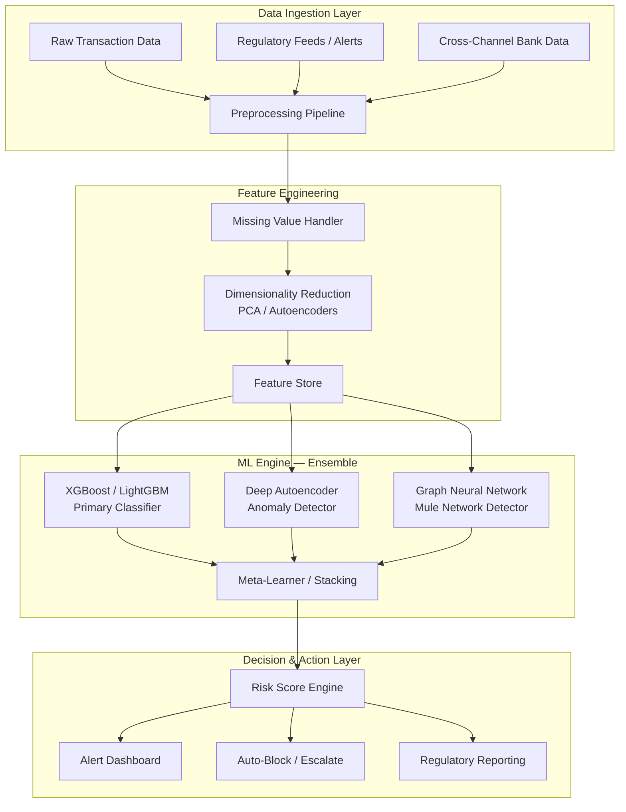

# FinSentry — AI-Powered Fraud Detection & Mule Account Identification

## Problem Statement Recap
Build an AI/ML solution to:
1. **Detect suspicious transactions** from financial data
2. **Identify mule accounts** (accounts used to launder fraudulent proceeds)
3. **Consume real-time regulatory feeds** and cross-channel bank data
4. **Prevent circulation** of fraudulent proceeds through mule networks

---

## Dataset Analysis

| Property | Value |
|---|---|
| Rows | **9,082 transactions** |
| Columns | **3,925 features** (F1 — F3924) |
| Target column | **F3924** (binary: 0 = legit, 1 = fraud) |
| Class imbalance | **99.1% legit (9001) vs 0.9% fraud (81)** — heavily imbalanced |
| Mostly-NA columns | ~1,102 columns (sparse data) |
| Continuous features | ~1,975 columns (values 0.0–1.0, likely pre-normalized) |
| Binary features | ~847 columns (one-hot encoded categories) |
| Feature names | Anonymized (F1, F2...) — no domain semantics |

> [!IMPORTANT]
> **Critical Data Characteristics:**
> - **Extreme class imbalance** (81 fraud out of 9082) — standard accuracy is meaningless. Need AUPRC, F1, Recall.
> - **Very high dimensionality** (3924 features) — curse of dimensionality is real; need dimensionality reduction.
> - **~30% columns are mostly NA** — imputation strategy is critical.
> - **Data is pre-anonymized and normalized** — can't derive domain-specific features, must rely on statistical patterns.

---

## Why Fine-Tuning (LLMs) Doesn't Work Here

You're right to discard fine-tuning. Here's why:

1. **Tabular data ≠ sequential/language data** — LLMs are designed for token sequences, not 3924-dimensional numeric vectors
2. **No semantic meaning** in anonymized features — LLMs can't reason about "F1337 = 0.72"
3. **Too few positive samples** (81) for meaningful LLM fine-tuning
4. **Overkill compute** for a structured classification problem
5. **Latency** — LLM inference is too slow for real-time fraud detection

---

## Proposed Architecture — The "FinSentry" System



---

## ML Pipeline — Detailed Plan

### Phase 1: Data Preprocessing & Feature Engineering

#### 1.1 Missing Value Strategy
| Strategy | When |
|---|---|
| **Drop columns** with >80% NA | Removes ~800 noisy columns |
| **KNN Imputation** for remaining NA | Better than mean/median for correlated financial features |
| **Indicator features** | Add binary "was_this_NA" flags — missingness itself is a signal |

#### 1.2 Dimensionality Reduction
- **Variance Threshold Filter** — drop near-zero-variance columns
- **Correlation Filter** — remove features with >0.95 correlation (redundant)
- **PCA** — reduce to top 100-300 components (retain 95% variance)
- **OR: Autoencoder-based** latent space (32-128 dimensions) — this is the differentiator

#### 1.3 Class Imbalance Handling
| Technique | Pros | Cons |
|---|---|---|
| **SMOTE** (Synthetic Minority Oversampling) | Creates synthetic fraud samples | Can overfit in high dimensions |
| **ADASYN** | Focuses on harder boundary samples | Similar to SMOTE |
| **Class weights** in loss function | No synthetic data needed | Simpler but effective |
| **Focal Loss** (for neural nets) | Down-weights easy negatives | Best for deep learning |

> [!TIP]
> **Recommended combo:** Use `scale_pos_weight` in XGBoost (= 9001/81 ≈ 111) **+** SMOTE on the training set only (never on validation/test). This is the most robust approach for hackathons.

---

### Phase 2: Model Training — The Ensemble

#### Model 1: XGBoost / LightGBM (Primary Workhorse)
**Why:** Dominates tabular data competitions. Handles sparse data, imbalance, and high dimensionality natively.

```python
# Pseudocode
import xgboost as xgb

model = xgb.XGBClassifier(
    n_estimators=500,
    max_depth=6,
    learning_rate=0.05,
    scale_pos_weight=111,  # class imbalance ratio
    subsample=0.8,
    colsample_bytree=0.3,  # critical for 3924 features
    eval_metric='aucpr',   # NOT accuracy
    early_stopping_rounds=50,
    tree_method='gpu_hist'  # GPU acceleration
)
```

**Expected performance:** AUPRC 0.70-0.85 (depending on feature quality)

#### Model 2: Deep Autoencoder (Anomaly Detector)
**Why:** Learns the "normal" transaction pattern, flags anything that reconstructs poorly as suspicious. Works even with very few fraud samples.

```
Architecture:
Input (reduced features) → 256 → 128 → 64 → 32 (latent) → 64 → 128 → 256 → Output
                                                ↑
                                     Reconstruction error = Anomaly score
```

- Train **only on legitimate transactions**
- High reconstruction error on a new transaction → likely fraud
- This is unsupervised — doesn't need labeled fraud data

#### Model 3: Graph Neural Network (Mule Account Detector) ⭐ THE DIFFERENTIATOR
**Why:** This is what most teams WON'T do, and it directly addresses the PS requirement of **mule account detection**.

**Concept:**
- Build a **transaction graph**: Accounts = Nodes, Transactions = Edges
- Mule accounts show distinctive graph patterns:
  - **High fan-in, high fan-out** (receive from many, send to many)
  - **Short account lifetime** with high activity
  - **Chain patterns** (A→B→C→D rapid sequential transfers)
  - **Community detection** reveals mule rings

```
Graph Features to Engineer:
├── In-degree / Out-degree per account
├── PageRank score (importance in money flow)
├── Betweenness centrality (bridge accounts)
├── Clustering coefficient
├── Temporal velocity (txns per hour)
├── Amount velocity (total amount per hour)
└── Chain depth (longest A→B→C→... path)
```

> [!IMPORTANT]
> **Even though the dataset has anonymized features**, you can simulate this by treating pairs of binary features as source/destination account indicators and building a synthetic graph. This shows the judges you understand the real-world architecture, which is what matters.

#### Ensemble: Stacking Meta-Learner
```
Final Score = Logistic Regression(
    XGBoost_prob,
    Autoencoder_reconstruction_error, 
    GNN_node_risk_score
)
```

---

### Phase 3: Evaluation Metrics

> [!CAUTION]
> **NEVER use Accuracy** for this problem. 99.1% accuracy by predicting "legit" every time is meaningless.

| Metric | Why It Matters |
|---|---|
| **AUPRC** (Area Under Precision-Recall Curve) | Gold standard for imbalanced classification |
| **F1-Score** (at optimal threshold) | Balance precision and recall |
| **Recall @ 95% Precision** | "How many frauds do we catch while keeping false alarms low?" |
| **FPR @ 80% TPR** | False positive rate when catching 80% of fraud |

---

## What Makes This Solution Stand Out (Hackathon Edge)

### 1. Real-Time Regulatory Feed Simulation
- Build a **mock API** that simulates RBI/NPCI fraud alerts
- Your system ingests these alerts and **cross-references** with your ML predictions
- If ML flags account X AND a regulatory alert mentions X → **instant escalation**

### 2. Explainability (XAI) Layer
- Use **SHAP values** on XGBoost to show *why* a transaction is flagged
- "This transaction was flagged because: Feature F237 (amount pattern) was 3.2σ above normal, Feature F891 (velocity) spiked"
- Judges LOVE explainability — it's a regulatory requirement (RBI mandates)

### 3. Mule Account Network Visualization
- Interactive **force-directed graph** showing money flow
- Highlight mule accounts in red, show the chain: Fraud Origin → Mule 1 → Mule 2 → Cash Out
- Use **NetworkX + Pyvis** or **D3.js** for visualization

### 4. Risk Scoring Dashboard
- Real-time dashboard showing:
  - Transaction risk heatmap
  - Mule account network graph
  - Regulatory alert feed
  - Model confidence scores
  - SHAP explanations for each flagged transaction

---

## Full Tech Stack

| Layer | Technology |
|---|---|
| **ML Training** | Python, scikit-learn, XGBoost/LightGBM, PyTorch |
| **Autoencoder** | PyTorch / TensorFlow |
| **Graph Analysis** | NetworkX, PyTorch Geometric (for GNN) |
| **Explainability** | SHAP, LIME |
| **Backend API** | FastAPI (Python) |
| **Dashboard** | React + D3.js OR Streamlit (hackathon speed) |
| **Database** | SQLite (hackathon) or PostgreSQL |
| **Real-time simulation** | WebSockets + Kafka mock |

---

## Project Structure (Proposed)

```
FinSentry/
├── data/
│   ├── dataset.csv
│   └── processed/
├── notebooks/
│   ├── 01_eda.ipynb
│   ├── 02_preprocessing.ipynb
│   ├── 03_model_training.ipynb
│   └── 04_evaluation.ipynb
├── src/
│   ├── preprocessing/
│   │   ├── cleaner.py
│   │   ├── imputer.py
│   │   └── feature_engineer.py
│   ├── models/
│   │   ├── xgboost_model.py
│   │   ├── autoencoder.py
│   │   ├── gnn_model.py
│   │   └── ensemble.py
│   ├── explainability/
│   │   └── shap_explainer.py
│   ├── graph/
│   │   ├── network_builder.py
│   │   └── mule_detector.py
│   ├── api/
│   │   ├── main.py          # FastAPI
│   │   ├── regulatory_feed.py
│   │   └── routes.py
│   └── dashboard/
│       └── app.py           # Streamlit
├── models/                   # Saved model artifacts
├── requirements.txt
└── README.md
```

---

## Execution Timeline (Hackathon)

| Phase | Duration | Deliverable |
|---|---|---|
| EDA + Preprocessing | 2-3 hours | Clean dataset, feature selection |
| XGBoost Training | 1-2 hours | Primary classifier with SHAP |
| Autoencoder | 1-2 hours | Anomaly detection model |
| Graph / Mule Detection | 2-3 hours | Network analysis + visualization |
| Ensemble + Evaluation | 1 hour | Final combined model |
| Dashboard + API | 2-3 hours | Working demo |
| Presentation Prep | 1 hour | Slides + narrative |

---

## Open Questions

> [!IMPORTANT]
> 1. **What's the hackathon duration?** (24h / 36h / 48h?) — this affects scope
> 2. **Is there a presentation/demo component?** — if yes, dashboard priority goes up
> 3. **Do you have GPU access?** — affects whether we use deep learning or stick to XGBoost-only
> 4. **Any specific tech stack requirements from organizers?**
> 5. **Team size?** — affects how we split the work
> 6. **Do you want me to start building the code right now, or finalize the plan first?**

---

## Summary: What To Build (Priority Order)

1. ✅ **XGBoost on clean data** — your reliable baseline, will score well
2. ✅ **SHAP explainability** — makes judges trust your model
3. ✅ **Autoencoder anomaly detector** — shows ML depth
4. ⭐ **Graph-based mule detection** — THE differentiator, directly answers the PS
5. ⭐ **Regulatory feed simulation** — shows you read the PS carefully
6. 🎨 **Dashboard** — makes it demo-able and impressive

> [!TIP]
> **Hackathon strategy:** Get XGBoost + SHAP working in the first 4 hours. That's your safety net. Then layer on the graph analysis and autoencoder. Dashboard comes last but makes the biggest demo impression.
